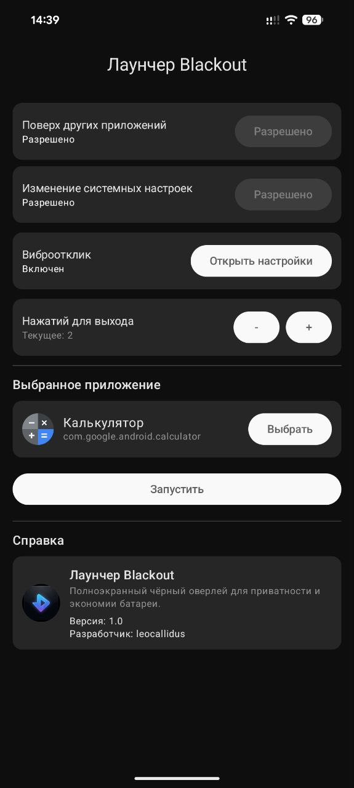
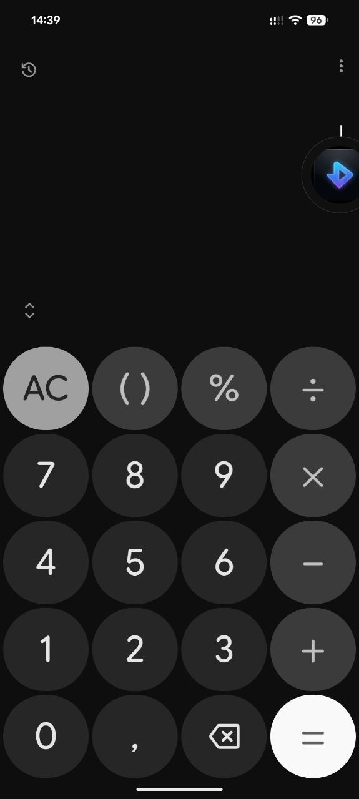

# Blackout Launcher

English | [Русский](README.ru.md)

Blackout Launcher is a privacy and battery‑saving tool that launches an app and lets you instantly cover the screen with a full‑screen black overlay. The overlay keeps the screen awake, hides system bars, and forces minimum brightness until you exit.

## Logo

## Screenshots

## Features

- Lists all launchable apps on the device (with search).
- Launches a target app and shows a floating blackout button.
- Tap the floating button to enable blackout mode.
- Tap the black screen N times to exit blackout (configurable in the main screen).
- Long‑press the floating button to stop the service.
- Drag the floating button to reposition it.
- Restores brightness on exit and on the next start if the service was killed.

## Requirements

- Android 7.0+ (minSdk 24).
- Overlay permission (Display over other apps).
- Write system settings permission (for minimum brightness).
- Vibration permission (for haptic feedback).

## Permissions

Declared in `AndroidManifest.xml`:

- `SYSTEM_ALERT_WINDOW` (overlay)
- `WRITE_SETTINGS` (brightness)
- `QUERY_ALL_PACKAGES` (app listing)
- `FOREGROUND_SERVICE`
- `FOREGROUND_SERVICE_SPECIAL_USE`
- `VIBRATE`

The app shows buttons to open system settings for overlay and write settings permissions.

## How to Use

1. Open the app.
2. Grant the required permissions.
3. Select a target app.
4. Set “Taps to exit blackout” if needed.
5. Tap **Start**.
6. In the target app, tap the floating button to enable blackout.
7. Tap the black screen N times to exit.
8. Long‑press the floating button to stop the service.

## Build & Run

Open the project in Android Studio and run the `app` module on a device or emulator.

## Notes

- On some OEM devices, system UI hiding behavior can vary.
- If the app list seems incomplete on an older emulator image, try a Play Store image or a newer API level.

## License

MIT License
